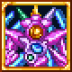

<!-- This uses our mod icon!!! If the root directory for out mod every moves, change this accordingly! -->
<!-- Image scaling here isn't nearest-neighbor, so we can get away with changing the width and height like this. Doesn't look great, though... -->

> **This is the `1.4` branch, check out the [`1.3` branch](https://github.com/JavidPack/CrystiliumMod/tree/1.3) for legacy code.**

# Crystilium Mod  

> Terraria 1.3 and 1.4 content mod running on tModLoader.

---

A complete Terraria "content mod" that features a brand-new biome, as well as additional enemies, items, and a boss to accompany it.
